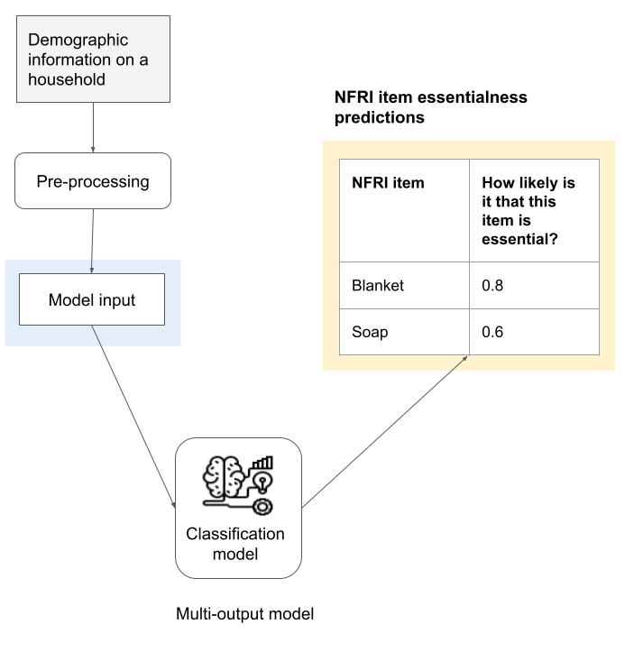
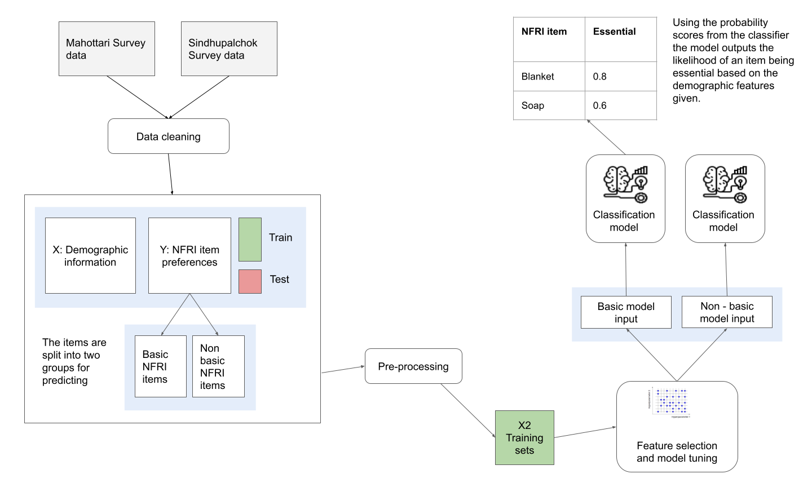

# Collective Crisis Intelligence Project for The Nepal Red Cross

## Contents

- [Background](#background)
- [Overview of the prototype](#overview-of-the-prototype)
- [Model workflow](#model-workflow)
  - [Data preprocessing](#data-preprocessing)
  - [Classification model development](#classification-model-development)
  - [Free text analysis](#free-text-analysis)
- [Running the models](#running-the-models)
  - [Steps to take before running the model](#steps-to-take-before-running-the-model)
  - [Input needed](#input-needed)
  - [Run the scripts](#run-the-scripts)
  - [Outputs](#outputs)

## Background

After a crisis strikes, people can be left without important supplies that support them to stay safe, healthy and comfortable. As part of coordinated efforts with other governmental and non-governmental organisations, the Nepal Red Cross Society (NRCS) provides Non-Food Related Items (NFRI) packages to affected communities. A typical family NFRI package includes:

- Tarpaulin
- Blanket
- Sari, Male Dhoti
- Shouting cloth, printed cloth, plain cloth, tericotten cloth
- Utensil set
- Water bucket
- Rope

These packages are often distributed after a crisis and an Initial Rapid Assessment has been carried out. Following interviews with the NRCS team members it was highlighted that there is a need to:

- Understand a better way of knowing what to distribute and when
- Understand what new NFRI items community members are interested in

This project uses new data collected from surveying x2 district () to understand firstly the how essential different household types see the existing items and secondly what new items would different household suggest in a flood crisis. The result of this analysis gives two outputs:

1. A predictive model that can predict item essentialness based on household information
2. A one-off piece of analysis showing what new items are suggested across different demographic features

## Overview of the prototype

The NFRI predict prototype takes in demographic information on a household such as the district they are from, the number of members of the household and if they have children and outputs the list of NFRI items with their predicted likelihood of being essential to that household (0 to 1 score) in a flood crisis. Figure 1 depicts the steps of the tool from input to predictions.

Figure 1: Overview of the prototype

## Model workflow

Figure 2 summarises the steps in the model workflow.

Figure 2: Model workflow

### Data Preprocessing

Our dataset comes from a survey conducted with the goal of identifying how essential a certain NFRI (Non Food Related Item) is for a particular household given the household features (like demographics and geographic location.) The original survey dataset contained 2338 observations and 73 features. The features can be divided into input and output features, with input features related to various demograhics and geography and output features related to preference labels (Essential, Desirable and Non Essential) given by the respondents for each NFRI. The dataset is then further divided into train, validation and test set.

For the data to be in the right format for modelling some data cleaning and pre-processing steps had to take place. Amoung these include:

- String replacements and character removal to make sure all values are consistent (in some cases headers and values changed as the data was processed and collected slightly differently from different Red Cross staff members and volunteers
- Recoding values in 'other' columns
- One-hot-encoding and scaling of numeric features
- Combining features such as age/gender breakdown to create new condensed features such as household size and percent female members

Sklearns pipeline was used to ensure any pre-processing steps that might leak test data into training was done inside CV folds whilst performing feature and model selection.

#### Recoding of NFRI preferences

In the survey community members were asked to provide a rating of their NFRI preferences in three categories: essential, desirable and unnecessary. The results found that very few rated an NFRI item as unnecessary. Also, after speaking with the Red Cross team through workshops we found many people felt that the term 'unnecessary' should not be used in the model.

With the above in mind and with the aim of the model producing results that would be meaningful to the user, we decide to recode the values to binary (0-1 non-essential-essential) and use the probability scores from the classfication model to predict the likelihood of an item being deemed essential by a household.

### Classification model development

In choosing the optimum model type and features for each basic and non-basic item groups, we Sklearns pipeline feature and Gridsearch to test different feature numbers, model types and hyper-paramters. The script to run these tests is stored in `cci_nepal/analysis/model_development/` and is called `model_development.py`.

After the feature selection and model tuning stage, the best performing model is run on the test set and a series of metrics are produced across items to evaluate its performace. These include - confusion matrix plots (saved in `outputs/figures/cm`, accuracy, micro F1, sensitivity and specificity.

### Free text analysis

In addition to the predictive model, a one-off script was built that explores the answers given in the survey around what new items different households suggest for future NFRI packs. This analysis is stored in `cci_nepal/analysis/free_text_analysis`.

## Running the model

The python scripts inside `cci_nepal/pipeline/classification_model/model_run` can be used to train and run the NFRI predict models on new data. The first script `model_save.py` fits the x2 models (basic and non-basic NFRI's) on the whole training set using the best model and parameters found in the model development stage and saves the fitted models to disk. The second script `model_run.py` loads the models and uses them to predict on a new data (the held out test set by default).

Before feeding data into the models, a few different pre-processing and cleaning steps are taken on the data to make sure it is in the right format. These steps are all held in functions saved in `data_manipulation.py` and `model_tuning_report.py` scripts found in `pipeline/classfication_model/`.

### Steps to take before runnning

To run the models you will first need to setup the project. Follow the below two steps to do this:

1. Clone the project and cd into the `cci_nepal` directory
2. Run the command `make install` to create the virtual environment and install dependencies
3. Inside the project directory run `make inputs-pull` to access the data from S3 (for those with access to the Nesta S3 account)

To note the project is setup using the Nesta Cookiecutter (guidelines on the Nesta Cookiecutter can be [found here](https://nestauk.github.io/ds-cookiecutter/structure/)).

### Input needed

After you setup the project you will need your training and test datasets. To build our models we used new data collected by the Nepal Red Cross in two districts - Sindhupalchok and Mahottari. The raw data from these surveys are saved in `cci_nepal/inputs/data/real_data/Full_Data_District.csv`. Running the script `data_splitting_survey.py` in `pipeline/classfication_model/` produces the training and test dataset.

To run the scripts the data needs to be in the same format as the survey data collected and saved in `cci_nepal/outputs/data/data_for_modelling/`.

### Run the scripts

Perform the following steps to run the scripts:

- `cd` to `cci_nepal/pipeline/classification_model/model_run`
- run `python3 model_save.py`
- run `python3 model_run.py`

### Outputs

There are two files created from running the models and saved to outputs:

- `basic_test_predictions.xlsx`
- `non_basic_test_predictions.xlsx`

These contain the survey inputs and predictions for each basic and non-basic NFRI items respectively. The format of each file will be slighlty different as different numbers of features are used and the NFRI outputs are different. The first set of columns will contain the feature names and the next set will contain the NFRI items with a 0 to 1 probability as to whether they are the item is essential.
